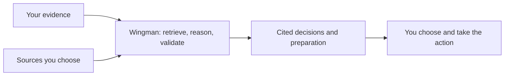
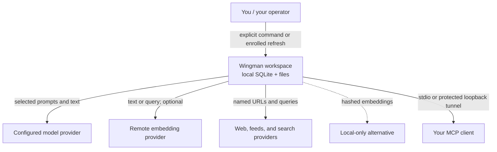

# Wingman

Wingman is a local-first, AI-assisted career intelligence system. It turns your
own evidence and selected public sources into cited opportunity assessments,
company and people intelligence, application material, and a prioritized daily
brief.

It is **not** an autonomous applicant, a mass-outreach tool, or a system that
invents familiarity or evidence. Models propose; deterministic code checks
claims against stored evidence; Wingman never sends a message, submits an
application, or performs another external write for you ([RFC-006](docs/RFC.md#rfc-006-human-approval-gates-for-all-external-actions)).



## Local-first is not local-only

The workspace—SQLite, inbox, reports, backups, and opt-in telemetry—is stored
locally by default. Some features deliberately send selected text or queries to
configured model, embedding, search, or website providers. Nothing is sent on
your behalf, but read and reasoning features can still create network egress.



See [Trust boundaries and data egress](docs/TRUST.md) for the feature-by-feature
matrix, local alternatives, credentials, hosted responsibilities, and
authoritative references.

## Try or install

The no-credential demo fetches public feed data into an isolated workspace:

```bash
uv tool install git+https://github.com/dhk/wingman
wingman init && wingman doctor
wingman demo
```

This is an **install from Git source**, not a package-index release. The current
release history is tagged through `v0.4.0`; Wingman does not currently promise a
stable compatibility window. It is a working, actively developed personal tool,
with some roadmap phases partial or not started. There is no project-provided
`curl | sh` installer: installation stays inspectable and delegates Python/tool
management to `uv`.

- [Hosted walkthrough](docs/WALKTHROUGH-HOSTED.md) — someone else operates it;
  no install or terminal
- [Guided walkthrough](docs/WALKTHROUGH.md) — install through a first real
  deliverable
- [Install and operations](docs/INSTALL.md) — source checkout, credentials,
  MCP, scheduling, backup, and troubleshooting
- [Graceful-degradation ladder](docs/SETUP.md) — what works with no keys, one
  provider, or the full setup

## Representative workflows

```bash
wingman ingest resume.pdf                 # cited canonical profile
wingman assess --url https://…            # evidence-backed fit and gaps
wingman evidence "kafka migration"        # search your own corpus
wingman company follow "Acme" --url https://acme.example
wingman overnight                         # consented refresh → action digest
wingman people brief "Jane" --purpose job # cited outreach raw material
```

Wingman also supports LinkedIn imports, people and company feeds, POV cards,
semantic similarity, approved-source research, application packs, answer recall,
print-ready exports, MCP parity, backups, and local telemetry. The preserved
feature catalogue and command detail live in [Capabilities](docs/CAPABILITIES.md).

## Use from Claude (MCP)

`wingman-mcp` exposes the same workspace and deterministic validation through
stdio for local clients, or through an opt-in loopback HTTP server and a tunnel
you operate. Treat a remote capability URL like a password and rotate it to
revoke access. Setup: [Install §4](docs/INSTALL.md#4-start-the-mcp-server).

```bash
claude mcp add wingman -- wingman-mcp
```

## Documentation and authority

| Subject | Authoritative document |
|---|---|
| Product purpose and invariants | [VISION.md](VISION.md) |
| Architecture | [docs/DESIGN.md](docs/DESIGN.md) |
| Durable decisions | [docs/RFC.md](docs/RFC.md); searchable [RFC index](docs/RFC-INDEX.md) |
| Delivery and maturity | [ROADMAP.md](ROADMAP.md), [docs/RELEASES.md](docs/RELEASES.md) |
| Evaluation | [docs/EVALUATION.md](docs/EVALUATION.md) |
| Install and operation | [docs/INSTALL.md](docs/INSTALL.md), [docs/SERVER.md](docs/SERVER.md) |
| Capabilities | [docs/CAPABILITIES.md](docs/CAPABILITIES.md) |
| Data egress and operator trust | [docs/TRUST.md](docs/TRUST.md) |
| Contributor and agent rules | [CONTRIBUTING.md](CONTRIBUTING.md), [AGENTS.md](AGENTS.md) |
| Vulnerability reporting | [SECURITY.md](SECURITY.md) |

Development checkout:

```bash
uv sync
export WINGMAN_DATA_DIR=./data
uv run wingman --help
uv run pytest && uv run ruff check . && uv run ruff format --check . && uv run mypy src
```

## License

MIT — see [LICENSE](LICENSE).
