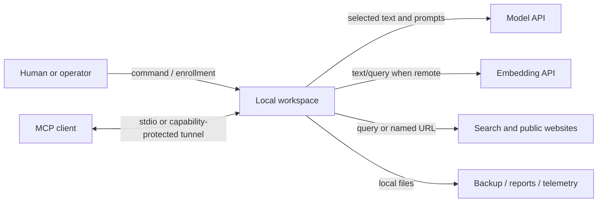

# Trust boundaries and data egress

Wingman is **local-first**, not **local-only**. The workspace is stored on the
machine that runs Wingman. A command can still send selected data to a configured
provider or fetch a URL. External content is untrusted input; Wingman does not
grant it authority to change policy or perform external writes.

## Data flow

## Provider and egress matrix

| Feature | What may leave the machine | Destination | Initiated by | Local/offline alternative | Authority |
|---|---|---|---|---|---|
| Profile/document extraction | Extracted document text and extraction prompt when a model step is used; a Google Docs URL is fetched | Configured model provider; explicitly named Google host | `ingest`, profile interview/import flows | Plain-text/format normalization and existing stored data remain local; semantic extraction requires a configured model | [RFC-004](RFC.md#rfc-004-model-routing-through-capability-classes), [RFC-013](RFC.md#rfc-013-resume-import-formats-pdf-docx-latex-google-urls) |
| Synthesis and reasoning | Relevant stored excerpts, instructions, and task context | Configured Anthropic or OpenRouter model route | `assess`, POV/theme/brief/research and other model-backed commands | Deterministic imports, validation, composition, and keyword retrieval continue; there is no equivalent local model adapter today | [RFC-004](RFC.md#rfc-004-model-routing-through-capability-classes), [models config](INSTALL.md#3-configure-keys) |
| Semantic embeddings/search | Document chunks during `embed`/sync and the search query during semantic search | Voyage when `provider = "voyage"` | `embed`, `sync`, similarity, semantic `search` | `provider = "hashed"` performs lower-quality embeddings locally; keyword FTS remains local | [RFC-010](RFC.md#rfc-010-semantic-similarity-via-embeddings-stored-in-sqlite), [RFC-022](RFC.md#rfc-022-unified-search-across-every-store-keyword-plus-semantic) |
| News and open-web search | Disclosed person/company query; research prompt/context for model-backed open-web research | Google News RSS or configured OpenRouter search (currently Exa-backed) | news snapshots or explicit deep-dive/research commands | Skip the command; stored snapshots and deterministic dossiers remain available | [RFC-014](RFC.md#rfc-014-recent-news-snapshots-via-a-public-news-rss-endpoint), provider implementation |
| Websites and feeds | Requested URL, ordinary HTTP metadata, and the public response | The explicitly supplied site/feed and redirects allowed by fetch policy | `assess --url`, ingest URL, feed/sync/research/follow/overnight | Import a local file or use already stored snapshots; scheduled fetches stop when enrollment is removed | [RFC-009](RFC.md#rfc-009-read-only-public-feed-fetching-explicitly-invoked), [RFC-015](RFC.md#rfc-015-company-research-over-user-approved-sources-phase-3-slice-iii), [RFC-018](RFC.md#rfc-018-follow-a-company-assembled-focus-and-the-consented-overnight-deep-refresh) |
| Local stdio MCP | Tool arguments stay between the local MCP client/process and workspace; a selected tool may then use a provider as above | Local process, plus any provider invoked by that tool | MCP tool call | CLI or local stdio; provider-free tools remain offline | [RFC-008](RFC.md#rfc-008-a-local-mcp-server-as-the-second-presentation-surface) |
| Loopback/tunnel MCP | Tool arguments and results cross the MCP client and user-managed tunnel | Loopback server, tunnel operator/network, MCP client | `wingman-mcp --http` plus a tunnel | CLI or stdio MCP | [RFC-017](RFC.md#rfc-017-remote-mcp-a-local-http-listener-behind-a-user-managed-tunnel) |
| Hosted/operator-managed use | Everything the user submits to that instance; downstream provider data described above | Operator-controlled host, storage, logs/backups, credentials, and configured providers | Web UI/MCP use and operator jobs | Self-host/local install | [RFC-048](RFC.md#rfc-048-one-shared-multi-tenant-process-share-nothing-data-capability-tokens-per-tenant), [Hosted walkthrough](WALKTHROUGH-HOSTED.md#because-someone-else-is-hosting-this) |
| Telemetry, reports, backups | Nothing automatically; files are written to paths on the Wingman host. Data leaves only if that path is synced/copied by the owner/operator | Local filesystem or owner-selected backup destination | `telemetry on`, report/export, `backup` | Telemetry stays off; keep outputs on a non-synced local path | [RFC-023](RFC.md#rfc-023-opt-in-local-usage-telemetry-with-transcript-harvesting), [Install §5](INSTALL.md#5-operate-it) |

Provider names describe the current implementation, not an architectural
promise. Routing remains provider-neutral; inspect the workspace `models.toml`
and the credentials held by the machine/operator to learn what this installation
actually uses. `wingman doctor` is safe and does not call providers; `wingman
keys test` deliberately does.

## Hosted operator/user boundary

In hosted mode, **the operator controls the host and workspace**. Tenant routing
keeps workspaces separate at the application boundary, but it does not protect a
user from the system administrator. The operator can access host files, service
logs, backup destinations, and the model credentials configured for that tenant
or service. They also choose the tunnel and can rotate capability URLs to revoke
access.

Before using a hosted instance, ask the operator:

- who has administrator access to the host and each backup destination;
- what is logged, how long logs/backups are retained, and how deletion works;
- which model, embedding, search, and tunnel providers receive data;
- whether credentials are tenant-specific and who can use or rotate them;
- how connector and UI links are delivered, revoked, and reissued;
- whether the host or backup folder is replicated to another service or region.

Anyone holding a connector or UI capability URL can act as that tenant. Treat it
like a password and ask the operator to rotate it after suspected disclosure.
